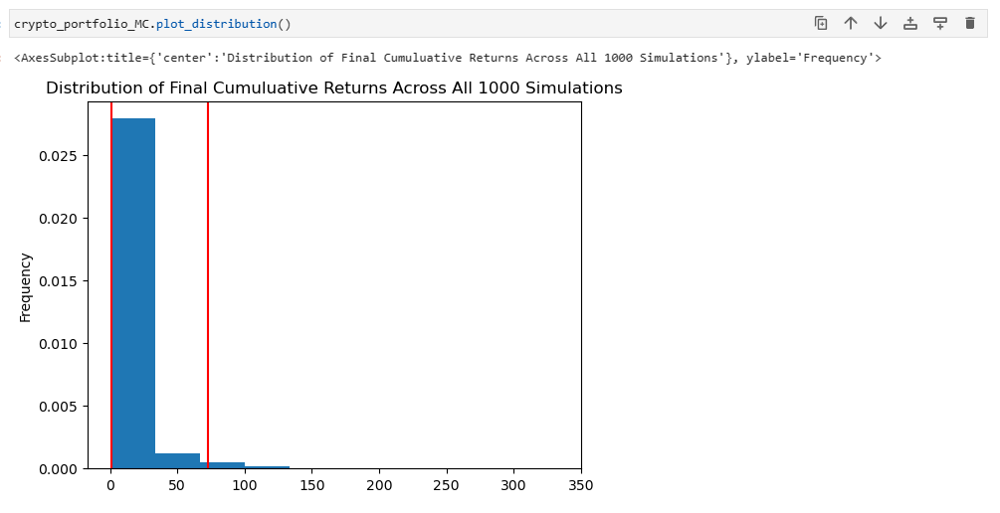
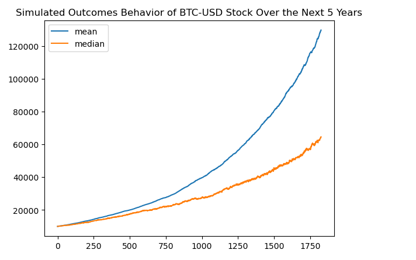
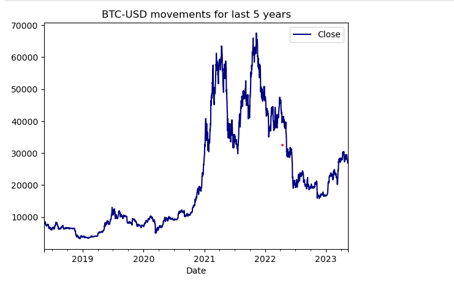

# Title: Crypto Advisor
*USYD FinTech Bootcamp Group Project 1*

# Team members

*Roshan, Alex, Ferdows, Shayan*

# Project description/outline
Takes the users desired mix of cryptos (BTC, ETH, LTC) and perform a Machine Learning and Monte Carlo simulation on the historical portfolio to assess possible future returns
# Stepwise development:
## Ideation: Research possibilities
## Prototype:
An initial tool that advises the user of the possible returns for a single Crypto Currency Pair (BTC-USD)
MVP: Iterating on the prototype so that it takes a portfolio of cryptos and advises of possible returns with a SMS message
## Future Product: 
GUI driven selection of portfolio and initial investment, desired growth % input, ML led analysis

# API and Librearies 
## Load libraries and dependencies
import os
import numpy as np
import pandas as pd
import matplotlib.pyplot as plt
import hvplot.pandas
## import alpaca_trade_api as tradeapi --> might not be needed
from MCForecastTools import MCSimulation
%matplotlib inline
## This is a new library not used previously in the class
import yfinance as yf
from datetime import datetime, timedelta
from sklearn.ensemble import RandomForestClassifier
from sklearn.metrics import precision_score

# Team thinking of a three part approach to the project that we can address based on time availability:
1. Single crypto portfolio Analyser (Prototype)
2. Multi crypto portfolio analyser Analyser (MVP)
3. World wide Multi crypto portfolio Analyser visualiser vs stock indices (nice to have)

**Take an MVP approach to solution**

- Think about notifications (SMS)

## Tools: 
- Coinbase to get Ticker Data
- Could look at machine learning
- Python Panels Library
~~WIP

# Visual Plots of the analysis 

|   | [Image 2](images/image2.png) |
|   | [Image 4](images/image4.png) |
|   | [Image 6](images/image6.png) |
|   | [Image 8](images/image8.png) |

# Research questions to answer
1. What datasets/APIs to use?
2. Which crypto currency to begin the analysis with?
3. How many crypto to include in a multi crypto portfolio?
4. What is the optimal way to conduct simulations?
5. Research what has been done online? (consult online tools)
6. Which APIs or Python Libraries can we use to do visualisations, create GUIs, etc?
~~WIP

# Datasets to be used
- Coinbase to get Ticker Data
~~WIP

# Rough breakdown of tasks

- GitHub Manager: Roshan
- Google Drive Manager: Ferdows
- GitHub README.md Manager: Ferdows
- Presentation Manager: Shayan

## Day 1
Leaning towards crypto portfolio analyser, that will take desired growth aspirations and return and optimal mix of crypto portfolios and trade time windows.
Initial steps:
- Have an initial tool that tells us how to maximise returns first: what crypto currency mix, what trade time window, etc.
- Create a follow up prototype that takes desired growth % and returns optimal mix/trade window.
- Roshan to do research on the APIs
- Ferdows to do research on optimising crypto portfolio returns online
- Ferdows to learn how to create a branch in the GitHub repo and maintain the README.md file
- Shayan to create presentation shell (once template is shared)
- Shayan to create jupyter lab notebook shell
- Shayan to look into a diagramming tool for product development mapping
- Alex to come out with 5 cryptos
- Alex to help do some research on the APIs
- Alex to pull sample code from previous lessons into jupyter lab notebook

## Day 2
Alex to complete random forest classifier code
Roshan Investigate notifications API
Shayan to review code
Shayan to add visualisation placeholder
Ferdows to update the README.md file after reviewing the branch creation

# Resources
- https://mljar.com/blog/dashboard-python-jupyter-notebook/
- https://stackoverflow.com/questions/28268818/how-to-find-the-date-n-days-ago-in-python

# Questions to Answer
What is the historical price of the crypto currency pairs?
What is the projected price tomorrow?
What is the associated risk?
What position should we hold (buy/sell)?
What is the expected return?
What is the accuracy of the model?

