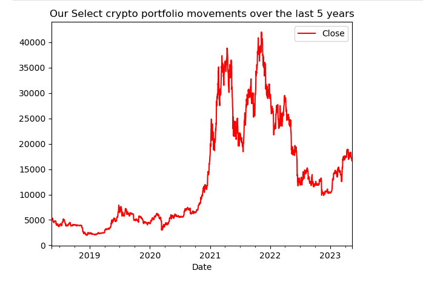
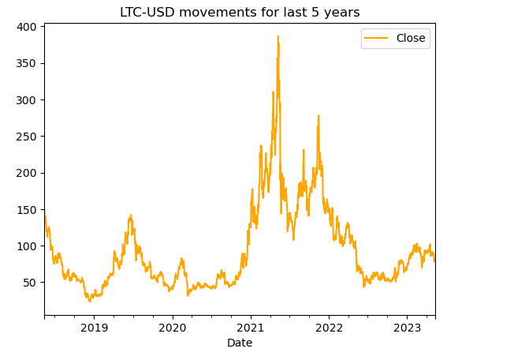
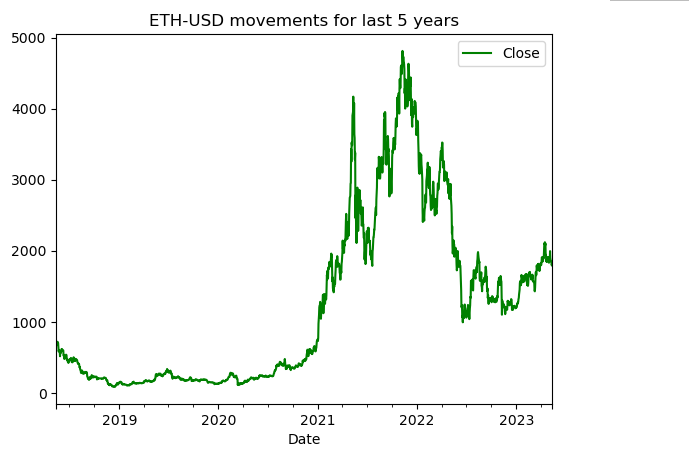
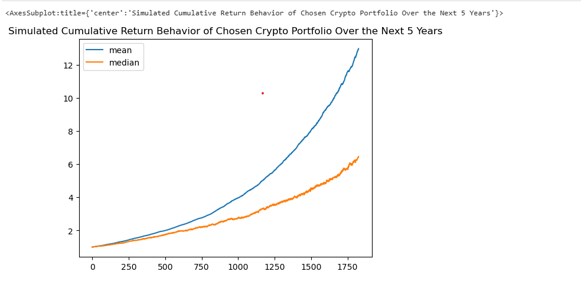
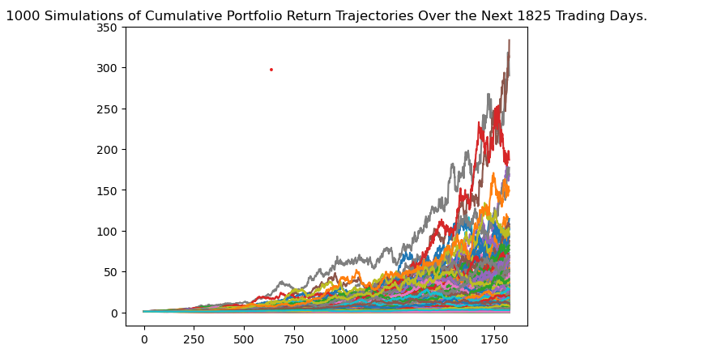

# Title: Crypto Advisor
## **USYD FinTech Bootcamp Group Project 1**

## **Team members :**

1. **Roshan** 
2. **Alex**
3. **Ferdows** 
4. **Shayan**

# Project description:
Takes the users desired mix of cryptos (BTC, ETH, LTC) and perform a Machine Learning and Monte Carlo simulation on the historical portfolio to assess possible future returns
# Stepwise development:
## 1. Ideation: Research possibilities
## 2. Prototype:
An initial tool that advises the user of the possible returns for a single Crypto Currency Pair (BTC-USD) 
MVP: Iterating on the prototype so that it takes a portfolio of cryptos and advises of possible returns with a SMS message 
## 3.Future Product: 
GUI driven selection of portfolio and initial investment, desired growth % input, ML led analysis

**Team thinking of a three part approach to the project that we can address based on time availability:**
1. Single crypto portfolio Analyser (Prototype)
2. Multi crypto portfolio analyser Analyser (MVP)
3. World wide Multi crypto portfolio Analyser visualiser vs stock indices (nice to have)

**Take an MVP approach to solution**

- Enhance with notifications for the user (e.g. SMS)

# Installation Guide and Libraries:
## Follwoing modules need to be installed prior to running the code: 
1. pip install yfinance
2. pip install yahoofinance
3. pip install clicksend-client
4. pip install phonenumbers
## Load libraries and dependencies
import os 
import numpy as np 
import pandas as pd 
import matplotlib.pyplot as plt 
import hvplot.pandas 
from MCForecastTools import MCSimulation 
%matplotlib inline 
## This is a new library not used previously in the class
import yfinance as yf 
from datetime import datetime, timedelta 
from sklearn.ensemble import RandomForestClassifier 
from sklearn.metrics import precision_score 
from __future__ import print_function 
import clicksend_client 
from clicksend_client import SmsMessage 
from clicksend_client.rest import ApiException 
from dotenv import load_dotenv 
import phonenumbers 
from phonenumbers import carrier 
from phonenumbers.phonenumberutil import number_type 

# Visual Plots of the analysis 

 
 
 
 
 
 
 
 

# Research questions to consider
1. What datasets/APIs to use?  *See above* 
2. Which crypto currency to begin the analysis with? *Started work with BTC due to range of data available* 
3. How many crypto to include in a multi crypto portfolio? *Started with considering 5, but it was not adding value to the work so the number was reduced to 3 to enhance time management of project* 
4. What is the optimal way to conduct simulations? *Monte Carlo sim is backwards looking and dependent on historical data and whilst useful is not a full proof tool, we explored the Random Forest Clacifier as an alternative but the ML algorithim did not work as desired due to the series nature of the data* 
5. Research what has been done online? (consult online tools) *See resources section below* 
6. Which APIs or Python Libraries can we use to do visualisations, create GUIs, etc? *See above* 

# presentation Slides : 

https://docs.google.com/presentation/d/1pL1iyRhPE8dyZXM-JqKMqu_CZkGzA_qKc68_VcMg8xc/edit?usp=sharing

# Rough breakdown of tasks

- GitHub Manager: Roshan
- Google Drive Manager: Ferdows
- GitHub README.md Manager: Ferdows
- Presentation Manager: Shayan
- RFC Research: Alex

### Day 1
Leaning towards crypto portfolio analyser, that will take desired growth aspirations and return and optimal mix of crypto portfolios and trade time windows.
Initial steps:
- Have an initial tool that tells us how to maximise returns first: what crypto currency mix, what trade time window, etc.
- Create a follow up prototype that takes desired growth % and returns optimal mix/trade window.
- Roshan to do research on the APIs
- Ferdows to do research on optimising crypto portfolio returns online
- Ferdows to learn how to create a branch in the GitHub repo and maintain the README.md file
- Shayan to create presentation shell (once template is shared)
- Shayan to create jupyter lab notebook shell
- Shayan to look into a diagramming tool for product development mapping
- Alex to come out with 5 cryptos
- Alex to help do some research on the APIs
- Alex to pull sample code from previous lessons into jupyter lab notebook

### Day 2
Alex to complete random forest classifier code 
Roshan Investigate notifications API 
Shayan to review code 
Shayan to add visualisation placeholder 
Ferdows to update the README.md file after reviewing the branch creation 

# Questions to Answer with the MVP
What is the historical price of the crypto currency pairs? *See code* 
What is the projected price tomorrow? *Consider for the future* 
What is the associated risk? *See code* 
What position should we hold (buy/sell)? *Consider for future* 
What is the expected return? *See code* 
What is the accuracy of the model? *See code* 

### Resources
- https://mljar.com/blog/dashboard-python-jupyter-notebook/
- https://stackoverflow.com/questions/28268818/how-to-find-the-date-n-days-ago-in-python
- https://www.section.io/engineering-education/stock-price-prediction-using-python/
- https://medium.com/tiendeo-tech/setup-jupyter-notebook-workspace-with-tensorflow-keras-on-windows-e0b4102ed826
- https://data-flair.training/blogs/stock-price-prediction-machine-learning-project-in-python/
- https://dashboard.clicksend.com/home
